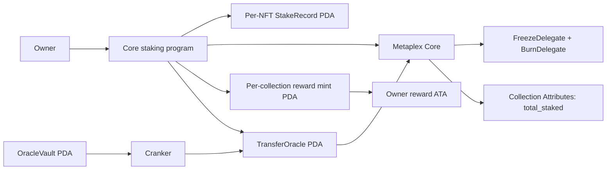

# Core NFT Staking

Anchor program for staking Metaplex Core NFTs without moving them out of their owners' wallets. It supports reward claims while frozen, BurnDelegate burn-to-earn, collection Attributes statistics, and an optional collection transfer oracle.

## Architecture

The project follows [turbine-amm-program](https://github.com/viraj124/turbine-amm-program/tree/b19e5addd780667d4b7aeccdf29ef8545559495f): thin `lib.rs` entrypoints, `Accounts` contexts and implementation methods in individual instruction files, shared state/constants/errors, and TypeScript LiteSVM integration tests with a reusable provider.

```text
programs/core_staking/src/
├── lib.rs                     # Entrypoints only
├── constants.rs               # PDA seeds, decimals, crank window
├── state.rs                   # StakeConfig, StakeRecord, TransferOracle, OracleVault
├── error.rs                   # Typed errors
├── core_accounts.rs           # Core layout/ownership validation and Attributes updates
├── rewards.rs                 # Shared config-signed SPL mint CPI
├── instructions.rs            # Instruction exports
└── instructions/
    ├── initialize_config.rs
    ├── stake.rs
    ├── claim_rewards.rs
    ├── unstake.rs
    ├── burn_staked_nft.rs
    ├── initialize_oracle.rs
    ├── update_oracle.rs
    ├── transfer_nft.rs
    ├── fund_oracle_vault.rs
    └── withdraw_oracle_vault.rs

tests/
├── core-staking.ts            # Initialization, authorization, stake and unstake
├── rewards.ts                 # Mint balances, burn, counters, payout arithmetic
├── oracle.ts                  # UTC boundaries, cranking, transfer restrictions
├── helpers/                   # LiteSVM provider and instruction/account helpers
└── fixtures/mpl_core.so       # Existing Core program fixture
runbooks/README.md             # Build, deployment and rollout notes
security-checklist.md         # Applied checks and trust assumptions
```



## Build and test

Use Anchor CLI **1.2.0**, Solana CLI **3.1.10**, Bun, and Node **20+**. Versions are pinned in `Anchor.toml`; the existing Rust and JavaScript lockfiles are retained. Anchor SPL's Token-2022 features are compiled because Anchor's mint initialization macro references them, but the reward mint and all token accounts are constrained to **legacy SPL Token**.

```sh
bun install --frozen-lockfile
bun run test                  # Builds SBF + IDL, then runs LiteSVM tests
bun run test:ts                # Tests only, using the most recently built SBF + IDL
cargo fmt --all -- --check
cargo clippy --offline --all-targets -- -D warnings
```

No local validator or RPC connection is used in the tests. LiteSVM runs the actual compiled staking program, the existing Core fixture, and SPL programs. Generated clients are in `target/idl/core_staking.json` and `target/types/core_staking.ts`.

## Accounts and PDA seeds

Every PDA is derived under the staking program ID. Pubkeys below are their 32-byte representations.

| Account | Seeds | Role |
| --- | --- | --- |
| `StakeConfig` | `config`, collection | Immutable economics, collection binding, current count; signs Core plugin and mint CPIs |
| `StakeRecord` | `stake`, asset | Owner, asset/config binding, original lock start, last reward checkpoint |
| Reward mint | `reward_mint`, config | Six-decimal SPL mint; config is its sole mint authority; no freeze authority |
| `TransferOracle` | `oracle`, config | Static collection-wide oracle address and UTC schedule |
| `OracleVault` | `oracle_vault`, config | Rent-exempt, program-owned lamport budget for cranks |
| Reward ATA | SPL ATA derivation | Only the staking owner's ATA for this reward mint can receive rewards |

## Instructions

| Instruction | Arguments | Authorization and behavior |
| --- | --- | --- |
| `initialize_config` | `min_lock_seconds: i64`, `reward_rate: u64`, `burn_bonus: u64` | Current collection update authority. Creates config and reward mint, initializes `total_staked = "0"`, delegates collection Attributes to config. |
| `stake` | None | NFT owner. Adds config-controlled BurnDelegate and frozen FreezeDelegate, creates record, increments both counters. |
| `claim_rewards` | None | Recorded owner. Mints pending rewards to the owner's ATA and advances the checkpoint. NFT stays frozen; original lock start stays unchanged. |
| `unstake` | None | Recorded owner after minimum lock. Settles pending rewards, thaws/removes both plugins, decrements both counters and closes the record to owner. |
| `burn_staked_nft` | None | Recorded owner after minimum lock. Thaws and burns through the config's BurnDelegate, mints pending rewards plus bonus, decrements both counters and closes the record. |
| `initialize_oracle` | `open_hour: u8`, `close_hour: u8`, `crank_reward: u64` | Current collection update authority. Creates oracle/vault and attaches the collection Oracle adapter with Transfer-only REJECT capability. |
| `update_oracle` | None | Any signer. Reads `Clock`, publishes schedule validation, pays an eligible boundary reward if funded. |
| `transfer_nft` | None; recipient supplied as account | Current NFT owner, inside the UTC window. Passes the validated oracle PDA as a remaining account to the Core transfer CPI. Core still enforces staking freezes. |
| `fund_oracle_vault` | `amount: u64` lamports | Any signer. Adds a donation to the crank budget. |
| `withdraw_oracle_vault` | `amount: u64` lamports | Current collection update authority. Recovers unspent budget while retaining rent exemption. |

### Reward economics

`pending = (Clock.unix_timestamp - last_claimed_at) * reward_rate`.

Amounts are **integer base units**, not whole tokens. At six decimals, a rate of `1_000` means `0.001` tokens per NFT per second. A burn bonus of `1_000_000_000` means **1,000 additional tokens**. These are test/example values; the collection authority chooses positive values at initialization. The program does not promise a market value for minted tokens.

The rate and bonus are immutable. Each claim advances `last_claimed_at`, so unstake and burn pay only rewards earned since the last claim. There is no fractional rounding loss because the rate is per whole second in base units. A same-second claim returns `NoRewards`; unstake and burn can still complete with zero pending time rewards. Both exit paths honor the original minimum lock, while claims are allowed during it. Arithmetic errors fail the whole transaction.

The mint has no application-level supply cap. Exits mint any pending rewards automatically and create the ATA if necessary, so users need SOL for transaction fees and any new account rent. Burning permanently destroys the NFT; it is an owner-signed action, never an admin operation.

### Collection statistics

`StakeConfig.total_staked` and the collection's actual Attributes entry `"total_staked"` are updated in the same transaction. Burn decreases the count too. All other attribute keys and values are preserved. The program checks the previous count and plugin authority before each update, rather than silently accepting inconsistent statistics.

Initialization preserves pre-existing unrelated attributes and replaces any old `total_staked` entries. Existing Attributes must be controlled by the collection update authority when setup is run; return any previous delegation first. After setup, the Attributes plugin is controlled by the config PDA.

### Transfer oracle and cranking

The optional oracle is enabled separately from staking. The example schedule is **09:00 inclusive to 17:00 exclusive UTC**, every day. Supported schedules satisfy `0 <= open_hour < close_hour <= 24`; overnight windows are not supported. `24` denotes a closing boundary at midnight.

Core reads a static oracle account; it cannot make stored results expire when the clock advances. To keep missed cranks from leaving an old open result usable, the oracle stores two V1-compatible lifecycle result blocks:

- `core_validation`, at byte offset **8**, is what Core reads using `ValidationResultsOffset::Anchor`. Transfer is **Rejected at rest**.
- `validation` publishes the latest observed schedule. `update_oracle` sets Transfer to **Pass** during open hours and **Rejected** otherwise; create/burn/update remain **Pass**.

`transfer_nft` checks the current on-chain time, temporarily writes Pass to `core_validation`, serializes it before the Core CPI, then restores Rejected before returning. A failed CPI rolls the entire transaction back. The adapter has REJECT capability only (`flags = 4`), so an open oracle cannot override a frozen NFT.

**With the oracle enabled, clients must use `transfer_nft`.** Direct Core transfers reject even during open hours. Wallets and marketplaces that only support direct Core transfers need this integration. This is the deliberate tradeoff that makes transfer-hour enforcement independent of crank availability.

A crank earns `crank_reward` lamports only in `[boundary, boundary + 60 seconds)`, starting at the opening or closing boundary. Only one funded call is paid per boundary across all callers. Earlier or late calls can refresh state but earn nothing; retries earn nothing after payment. An empty vault never prevents updates or clock-valid transfers. If funded within the same window, a later call can still collect the unpaid reward. Missed rewards do not accumulate.

The vault retains its rent reserve. Donations fund discretionary future crank payouts; the collection authority can withdraw unspent funds. No rewards are promised when the vault is empty.

## Client usage

Use the generated `CoreStaking` type with `@anchor-lang/core`. These snippets assume `program` is connected to an Anchor provider, `admin` and `owner` are signers, and the Core collection/asset already exist. See `tests/helpers/core-staking.ts` for complete executable construction and PDA helpers.

```ts
const [config] = PublicKey.findProgramAddressSync(
  [Buffer.from("config"), collection.toBuffer()], program.programId,
);
const [rewardMint] = PublicKey.findProgramAddressSync(
  [Buffer.from("reward_mint"), config.toBuffer()], program.programId,
);

await program.methods
  .initializeConfig(new BN(604_800), new BN(1_000), new BN("1000000000"))
  .accounts({ admin: admin.publicKey, collection })
  .signers([admin]).rpc();

await program.methods.stake()
  .accountsPartial({ owner: owner.publicKey, config, collection, asset })
  .signers([owner]).rpc();

// Derive rewardsAta with the legacy SPL Token associated-token address helper.
const [stakeRecord] = PublicKey.findProgramAddressSync(
  [Buffer.from("stake"), asset.toBuffer()], program.programId,
);
const payoutAccounts = {
  owner: owner.publicKey, config, collection, asset, stakeRecord,
  rewardMint, rewardsAta,
};
await program.methods.claimRewards().accountsPartial(payoutAccounts)
  .signers([owner]).rpc();
// After the lock expires, choose one exit:
// await program.methods.unstake().accountsPartial(payoutAccounts).signers([owner]).rpc();
// await program.methods.burnStakedNft().accountsPartial(payoutAccounts).signers([owner]).rpc();

await program.methods.initializeOracle(9, 17, new BN(10_000))
  .accountsPartial({ admin: admin.publicKey, config, collection })
  .signers([admin]).rpc();
const [oracle] = PublicKey.findProgramAddressSync(
  [Buffer.from("oracle"), config.toBuffer()], program.programId,
);
const [oracleVault] = PublicKey.findProgramAddressSync(
  [Buffer.from("oracle_vault"), config.toBuffer()], program.programId,
);
await program.methods.fundOracleVault(new BN(1_000_000))
  .accountsPartial({ funder: admin.publicKey, config, oracleVault })
  .signers([admin]).rpc();
// Any funded signer can crank near a boundary.
await program.methods.updateOracle()
  .accountsPartial({ caller: owner.publicKey, config, oracle, oracleVault })
  .signers([owner]).rpc();
// Only unstaked NFTs can transfer; use current time inside the configured hours.
await program.methods.transferNft()
  .accountsPartial({ owner: owner.publicKey, config, collection, asset, newOwner, oracle })
  .signers([owner]).rpc();
```

## Compatibility and references

**This changes the original account layouts and `initialize_config` signature.** It is not an in-place migration for existing deployed configs or stake records. Fresh deployments work as provided. Existing deployments need an explicit migration plan; see `runbooks/README.md` before upgrading a program with live stakes.

Security design references [Safe Solana Builder](https://github.com/Frankcastleauditor/safe-solana-builder/tree/9e94436dcf4b5dfd6d837eb70cf88b9048e72e5d) and the [Metaplex Oracle specification](https://www.metaplex.com/docs/smart-contracts/core/external-plugins/oracle). The implementation retains this project's existing Anchor/TypeScript test architecture. See `security-checklist.md` for authority assumptions, supported plugin combinations, and verification scope.
